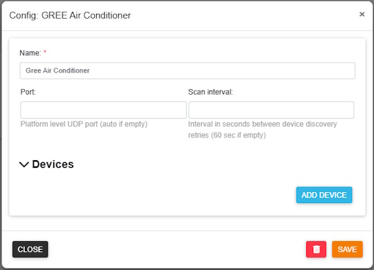
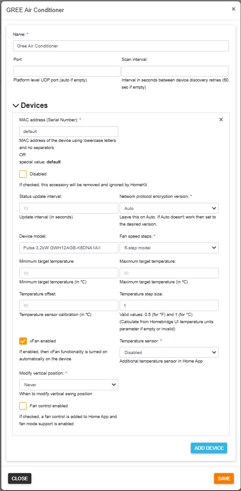
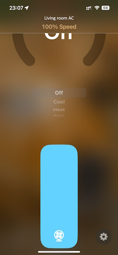

<span align="center">

# Homebridge GREE Air Conditioner Platform Plugin

[](https://github.com/homebridge/homebridge/wiki/Verified-Plugins)
[](https://www.npmjs.com/package/homebridge-gree-ac)
[](https://www.npmjs.com/package/homebridge-gree-ac)
[](https://www.npmjs.com/package/homebridge-gree-ac)
[](https://paypal.me/eibenp)

:gb: :de: :fr: :hungary: :es: :portugal:

</span>

> _*** Breaking changes ***_
> 
> Please read the [**Upgrade section**](#upgrade) before upgrading from version earlier than **v2.0.0** !
>
> _It is also recommended to read the [upgrade section](#upgrade) before any upgrade. It contains useful information regarding the latest version._

[Homebridge GREE Air Conditioner Platform Plugin](https://github.com/eibenp/homebridge-gree-airconditioner) is a dynamic platform plugin for [Homebridge](https://github.com/homebridge/homebridge) which allows control of GREE Air Conditioner devices from [Apple's Home App](https://www.apple.com/home-app/). (Makes GREE Air Conditioners HomeKit compatible.)

The plugin finds and adds all GREE Air Conditioner devices to the Home App automatically if they are located on the same subnet as Homebridge. _(This feature can be disabled by configuration parameter.)_ In most cases only a minimal configuration is required. If default configuration is not appropriate, then the parameters can be customized. To set some parameters to a custom value assigned to all devices, a special device has to be added to the configuration with MAC address set to 'default'. To customize a specific device you have to specify it's MAC address. Device specific parameters override the default parameters. Each Air Conditioner device appears in the Home App as a Heater Cooler device (and a Fan device if fan control is enabled). It is also possible to add a separate Temperature Sensor accessory to Home App (if temperature sensor is supported by the physical device). This allows to define automations (e.g. turn on) based on current temperature in the room. _Be careful, if the device does not support internal temperature sensor but is added as a separate accessory, Home App will use the target temperature not the measured one._ Child accessory does not appear in Home App if physical sensor is not available in the AC unit.

Quiet / Auto / Powerful mode is supported by the fan speed control. In Heater Cooler accessory zero fan speed means off. Minimum value turns on Quiet mode. Next value is Auto mode. Maximum value is Powerful mode. All other values between them are exact fan speeds (Low, MediumLow**, Medium, MediumHigh**, High) Quiet and Powerful modes are unsupported in Auto mode. If these speed modes are selected in Home App then the device will fix the incorrect settings and the Home App's speed control will be automatically adjusted to the nearest supported value.

Optional fan accessory has it's own speed control. It displays fan speed as a percentage value, but the percentage displayed in the Home App is not related to the actual fan speed percentage of the AC device. (GREE Air Conditioners do not support controlling the fan speed by percentage.) Fan accessory's zero fan speed means off. Quiet mode and Powerful mode are not supported by Air Conditioner devices in fan mode. Fan accessory's maximum value (100%) means Auto mode. All other values between 0% and 100% are exact fan speeds (Low, MediumLow**, Medium, MediumHigh**, High). The actual percentage values of the Home App fan accessory is based on the AC device type (3- or 5-speed model).

(**) these values are supported only on 5-speed models

Devices are identified by MAC Address (Serial Number). It can be queried using the official [GREE+ mobile app](https://apps.apple.com/us/app/gree/id1167857672). (The app is required to connect the devices to the local WiFi network for the first time.) If you want to customize a device (e.g. set a custom name) then you have to add it to the configuration and specify it's MAC address. Adding a device located on a different subnet also requires to add the device to the configuration and specify the MAC address and the IP address. To skip a device from Home App also requires to add it's MAC address to the configuration and set the "disabled" parameter to true. Some parameters are changeable only by disabling and re-enabling the device because they are read by Home App only once. _(These parameters are discussed later.)_ To customize all devices on the same way, a special device has to be added to the configuration. This special device must have the MAC address parameter set to "default". Parameters of devices identified by exact MAC addresses take precedence over parameters set by the "default" device.

xFan function is supported, but it works automatically if enabled in Homebridge configuration. If xFan is enabled for the device, it is automatically turned on when you select a supported operating mode in Home App. If xFan is disabled, the Home App will not modify its actual setting in any case.

Temperature display units of the physical device can be controlled using the Home App. (Configuration settings are required to be specified always in Degrees Celsius, independently from the display units.)

Vertical swing mode can be turned on/off, but special swing settings can't be controlled using the Home App. If device default vertical swing position is not acceptable when oscillation is disabled, it can be set to a pre selected position by configuration settings. (There are multiple options for configuring the plugin to update the vertical swing position.)

Silent mode (no beep on commands) is supported on some devices. It is firmware version dependent.

This plugin is designed to be as simple and clear as possible and supports primarily the functions of the Home App's Heater Cooler accessory.

## Requirements

* Node.js (>= 20.19.0 || >= 22.13.0 || >= 24.0.0) with NPM
* Homebridge (>= 1.8.0 || >= 2.0.0-beta.0)

The plugin finds all supported units automatically if they are located on the same subnet. If Homebridge is configured to use only selected network interfaces then auto detection is also limited to these selected interfaces. AC units on different subnets are also supported if the unit's IP address is set in the configuration. (MAC address have to be set correctly also.) Auto detection can be disabled by configuration parameter.

IPv4 address is required. GREE Air Conditioners do not support IPv6 nor other network protocols.

All devices must have an IP address which is reachable on the network for the plugin. Devices behind a bridge (GCloud) are supported if the bridge is reachable on the network for the plugin.

This is not plugin dependency but its good to know that Homebridge server host address must be static. If the host address changes then Homebridge looses connection with Home App and only Homebridge restart restores the connection.

## Supported devices

* GREE Air Conditioners with WiFi support (hardware version v1.x.x, v2.x.x and v3.x.x)
* May work with other GREE compatible AC units (e.g. Sinclair)
    * Successfully tested with Sinclair SIH-13BITW
* GREE Air Conditioners connected to GCloud (bridge and subdevices topology)
 
> If you get _"error:1C80006B:Provider routines::wrong final block length"_ error message then your device is not supported or incorrect encryption version is selected.
>
> If you get _"Error: Device is not bound ..."_ error message then your device may not be supported. (The same error occures when device is malfunctioning but if turning the power supply off and on does not solve the problem then your device is not supported.)

It is not recommended to use Home App and the Official GREE+ or Ewpe Smart mobile apps side by side. In some cases the mobile apps can set the Air Conditioner device into a restricted state where Homebridge can't bind the plugin to the device because the device does not respond on device query requests which are required to initalize the plugin. It is highly recommended to use the mobile app only for the initial setup of the air conditioner, and later it is fine to use only the Home App and the physical remote control for everyday tasks. (Usually when the AC device is not responding to the Homebridge plugin but is communicating fine with the mobile app, then power cycling the AC device resolves the problem.)

By default this plugin tries to auto detect the network protocol encryption version. If not the right version is selected there can get errors and the AC device will not correctly work. It is possible to force a network protocol encryption version in configuration file. If auto detection does not work then it is recommended to try all possible values to check if the device is compatible or not.

## Known limitations

This plugin was designed to support the Home App's Heater Cooler functionality using GREE Air Conditioners. Some special features of GREE AC's are not supported natively by Apple and also dismiss support in this plugin.
* Fan mode is supported by an additional Fan control accessory in Home App. Using this Fan control is optional. If Fan control is disabled, the Home App sees the AC device operating in fan mode as off. The Heater Cooler accessory and the Fan accessory cannot be active at the same time. The Heater Cooler accessory is always inactive if the AC device is operating in fan mode, and the Fan accessory is always inactive if the AC device is operating in heating or cooling mode.
* Dry mode is not supported. The Home App sees the AC device operating in dry mode as off.
* Lights of the AC unit can't be controlled.
* Additional device functions (e.g. health mode, sleep, SE) are not supported.
* Horizontal swing control is not supported, it remains the same as set directly on the device.
* GREE AC units do not support temperature ranges in auto mode, so temperature ranges have zero length in Home App.
* GREE AC units are not able to display decimals of temperature values (if set to half a degree, e.g. 21.5 °C, then unit display may not be in sync with temperature set in Home App). To avoid this inconsistency it is recommended to set the **temperatureStepSize** configuration parameter to 1, when the AC unit is used in Celsius display mode, and to 0.5 in Fahrenheit display mode. The most convenient version is to use the Home App device (e.g. iPhone) in the same temperature display mode as the AC unit and to set the temperatureStepSize parameter to the appropriate value also. Set Homebridge UI to the same temperature units.
* There is no way to get current heating-cooling state from the AC unit in auto mode, so displayed state in the Home App is based on temperature measurement, but internal sensor is not precise enough to always display the correct state.
* Devices without a built-in temperature sensor display the target temperature as current temperature not the measured one. (Some AC firmware versions do not report the measured temperature but the unit has a built-in sensor. They are handled by the plugin as devices without a sensor.)
* Silent mode (no beep on commands) is not supported on all AC units. There are some firmware versions (especially older ones) which do not support muting of commands. Some others have a bug and muting is in effect only on every second command. In these cases a firmware upgrade may help if available.

## Installation instructions

It is recommended to install the plugin using the graphical user interface of Homebridge ([Homebridge Config UI X](https://www.npmjs.com/package/homebridge-config-ui-x)). You can find the plugin if you search on the Plugins page for GREE Air Conditioner ('GREE AC' or 'homebridge-gree-ac' if you'd like an exact match). It is recommended to configure the plugin using the same GUI controls.

Command line install:
```
npm install homebridge-gree-ac -g
```
If successfully installed and configured, your devices will appear on the Homebridge GUI Accessories page and also in Home App (if Homebridge is already connected to the Home App). (If the additional temperature sensor is enabled, then 2 items will be displayed for supported devices (Heater Cooler and Temperature Sensor). If Fan control is enabled, then an additional Fan accessory is also displayed in Home App.)

## Upgrade

Always check out your current settings in Homebridge and also in Home App (including scenes and automation rules) before you start an upgrade!

### v2.2.x to v2.3.x

The upgrade is automatic by installing the latest version.

### v2.1.7 to v2.2.x

The upgrade is automatic by installing the latest version. It is highly recommended to update the configuration settings because some new parameters were introduced in v2.2.0 and there is also a parameter which was renamed.

Fan mode support is new in version v2.2.0. It is disabled by default. To enable it the "fanControlEnabled" parameter must be set in configuration file.

In v2.2.0 it is also possible to set default customized parameters for multiple devices by adding a special device with MAC address set to 'default'.

The "overrideDefaultVerticalSwing" configuration parameter was renamed to "modifyVerticalSwingPosition" and new options were added to support some new cases.

### Any version to v2.1.7

The upgrade is automatic by installing the latest version. If upgrading from v2.1.6 no configuration changes are needed to continue the use of the plugin with original settings. Please see the following upgrade sections if upgrading from an earlier version.

**Important change: All devices are automatically added to the Home App if they are not listed and disabled in configuration and they are located on the same subnet.** Earlier versions skipped the devices which were not found in configuration file.

### v2.1.2 - v2.1.5 to v2.1.6

The upgrade is automatic by installing the latest version but configuration settings should be updated.

#### Configuration update steps

- <ins>Recommended:</ins> Using the graphical user interface of Homebridge ([Homebridge Config UI X](https://www.npmjs.com/package/homebridge-config-ui-x))
  - Open plugin configuration
  - Review and update settings if needed
  - If you have changed the 'Temperature step size' parameter to 1
    - Set each device (with value 1) to disabled
    - Save changes
    - Restart Homebridge
    - Wait until all devices are listed in the log as skipped
    - Set devices to enabled
  - Save changes
  - Restart Homebridge
  - If any device was disabled and re-enabled in previous steps then recreate automations _(automations are lost when you disable a device)_
- **OR** <ins>Alternative:</ins> Edit the configuration file directly _(Needed only if temperatureStepSize should be added with value 1)_
  - Add the following parameter to each devices in the devices section:
    - temperatureStepSize _(device disabling and re-enabling is needed if value is set to 1)_
      - Change "disabled" to true
      - Save changes
      - Restart Homebridge
      - Wait until all devices are listed in the log as skipped
      - Change "disabled" to false
  - Save changes
  - Restart Homebridge
  - If any device was disabled and re-enabled in previous steps then recreate automations _(automations are lost when you disable a device)_

### v2.0.0 - v2.1.1 to v2.1.2 or later

The upgrade is automatic by installing the latest version but configuration settings should be updated.

#### Configuration update steps

- <ins>Recommended:</ins> Using the graphical user interface of Homebridge ([Homebridge Config UI X](https://www.npmjs.com/package/homebridge-config-ui-x))
  - Open plugin configuration
  - Review and update settings if needed
  - Save changes _(pressing the Save button is required to update the configuration to new version even if no changes needed in the displayed values)_
    - if 'Temperature step size' parameter is set to 1 _(available in version v2.1.6 and later)_ then device disabling and re-enabling is needed:
      - Set each device (with value 1) to disabled
      - Save changes
      - Restart Homebridge
      - Wait until all devices are listed in the log as skipped
      - Set devices to enabled
  - Restart Homebridge
  - If any device was disabled and re-enabled in previous steps then recreate automations _(automations are lost when you disable a device)_
- **OR** <ins>Alternative:</ins> Edit the configuration file directly
  - Remove the following parameters from the platform's main section:
    - port _(it may be kept if you want to set the UDP port manually)_
    - scanAddress
    - scanCount
    - scanTimeout
  - Optionally you can add the following parameter to the platform's main section:
    - scanInterval _(default is 60 if missing, needed only if other value required)_
  - Optionally you can add the following parameter to each devices in the devices section _(available in version v2.1.6 and later)_:
    - temperatureStepSize _(device disabling and re-enabling is needed if value is set to 1)_
      - Change "disabled" to true
      - Save changes
      - Restart Homebridge
      - Wait until all devices are listed in the log as skipped
      - Change "disabled" to false
  - Save changes
  - Restart Homebridge
  - If any device was disabled and re-enabled in previous steps then recreate automations _(automations are lost when you disable a device)_

Some new parameters were introduced in version v2.2.0. They have to be added to configuration if the new features should be turned on.

### v1.x.x to v2.0.0 or later

There is no clean way to update the plugin to release v2.0.0 or later if you are using an older version (v1.x.x). You need to remove and reinstall the plugin during upgrade.

#### Upgrade steps

1. Check out your current settings in Homebridge and also in Home App (including scenes and automation rules)
1. Uninstall the old version (this will remove all settings also)
1. Install the new version
1. Configure plugin in Homebridge
1. Assign accessories to rooms and recreate scenes and automations in Home App

## Example configuration

_Only the relevant part of the configuration file is displayed:_

The plugin supports Homebridge configuration UI in multiple languages. International UI requires [Homebridge Config UI X](https://www.npmjs.com/package/homebridge-config-ui-x) version v5.13.0 or later. Unsupported UI versions and languages use the English UI.
Supported languages:

- English (EN)
- Deutsch (DE - German)
- Español (ES - Spanish)
- Français (FR - French)
- Magyar (HU - Hungarian)
- Português (PT - Portuguese / Portugal)

### Minimal configuration

Minimal configuration requires no special knowledge and uses default values for all devices.

```
    "platforms": [
        {
            "name": "Gree Air Conditioner",
            "platform": "GREEAirConditioner"
        }
    ]
```

* name - Unique name of the platform plugin
* platform - **GREEAirConditioner** (fixed name, it identifies the plugin)

Minimal configuration is appropriate for 5-speed models. Device names are read from the AC units (usually the MAC address or part of the MAC address). Target temperature can be set between 16 and 30 °C. The temperature display units settings are read from the UI settings (or using Fahrenheit if not set in UI configuration). Target temperature step size is set to 0.5 in Fahrenheit mode and 1 in Celsius mode. xFan function is enabled. No other special features (e.g. additional temperature sensor, fan mode support) are enabled.

Minimal configuration:



### Customized default parameters

It is possible to set some or all parameters to a customized value which is assigned to each device which does not override the parameter. This functionality requires a custom device with MAC address set to 'default'.

```
    "platforms": [
        {
            "name": "Gree Air Conditioner",
            "platform": "GREEAirConditioner",
            "devices": [
                {
                    "mac": "default",
                    "statusUpdateInterval": 10,
                    "encryptionVersion": 0,
                    "model": "Pulse 3.2kW GWH12AGB-K6DNA1A/I",
                    "speedSteps": 5,
                    "minimumTargetTemperature": 16,
                    "maximumTargetTemperature": 30,
                    "sensorOffset": 40,
                    "temperatureStepSize": 1,
                    "temperatureSensor": "disabled",
                    "xFanEnabled": true,
                    "modifyVerticalSwingPosition": 0,
                    "defaultVerticalSwing": 0,
                    "fanControlEnabled": false,
                    "defaultFanVerticalSwing": 0,
                    "silentTimeRange": "",
                    "disabled": false
                }
            ]
        }
    ]
```

* mac - this parameter has a special fixed value 'default' if you want to customize parameters to be assigned to multiple devices
* disabled - if set to 'true' then no parameters are read from the configuration as customized defaults

See the [Full configuration section](#full-configuration) for more information about the parameters!

The following parameters are ignored in 'default' device entry:
- name
- ip
- port



You can always override any default parameter by adding a device identified by MAC address.

### Full configuration

```
    "platforms": [
        {
            "name": "Gree Air Conditioner",
            "platform": "GREEAirConditioner",
            "port": 7002,
            "scanInterval": 60,
            "disableAutoDetection": false,
            "devices": [
                {
                    "mac": "502cc6000000",
                    "name": "Living room AC",
                    "ip": "192.168.1.2",
                    "port": 7003,
                    "statusUpdateInterval": 10,
                    "encryptionVersion": 0,
                    "model": "Pulse 3.2kW GWH12AGB-K6DNA1A/I",
                    "speedSteps": 5,
                    "minimumTargetTemperature": 16,
                    "maximumTargetTemperature": 30,
                    "sensorOffset": 40,
                    "temperatureStepSize": 1,
                    "temperatureSensor": "disabled",
                    "xFanEnabled": true,
                    "modifyVerticalSwingPosition": 0,
                    "defaultVerticalSwing": 0,
                    "fanControlEnabled": false,
                    "defaultFanVerticalSwing": 0,
                    "silentTimeRange": "",
                    "disabled": false
                }
            ]
        }
    ]
```
_It's not recommended to add the port and ip parameters. The above example contains them but only for showing all optional parameters also._

* **name** - Unique name of the platform plugin
* **platform** - **GREEAirConditioner** (fixed name, it identifies the plugin)
* **port** - free UDP port (optional) (plugin will use this port in bridge level network communication (e.g. device detection); valid values: 1025 - 65535) **Do not specify a port unless you have trouble with automatic port assignment!**
* **scanInterval** - time period in seconds between device query retries (defaults to 60 sec if missing)
* **disableAutoDetection** - if set to 'true', only the AC units listed in the devices section will be enabled
* **devices** - devices should be listed in this block (specify as many devices as you want to customize or disable)
  * **mac** - MAC address (Serial Number) of the device (required to identify the device, also if only one device exists) Use the 'default' keyword instead of the MAC address to define default configuration for multiple devices. **Must be unique across all devices!**
  * **name*** - custom name of the device (optional) Please use only alphanumeric, space, and apostrophe characters. Ensure it starts and ends with an alphabetic or numeric character, and avoid emojis. (The name is changeable in Home App and any changes made in Home App are kept until the device is disabled which removes it from Home App.)
  * **ip** - device IP address (optional) Address is auto detected if this parameter is missing. **Specify only if device is located on a different subnet than homebridge!**
  * **port** - free UDP port (optional) (plugin will listen on this port for data received from the device; valid values: 1025 - 65535) **Do not specify a port unless you have trouble with automatic port assignment!**
  * **statusUpdateInterval** - device status will be refreshed based on this interval (in seconds, default is 10 seconds)
  * **encryptionVersion** - Auto (0) is fine for most AC units. If auto does not work then you can force v1 (1) or v2 (2) encryption version to use in network communication. **Encryption version is always auto (0) for devices behind GCloud bridge.**
  * **model*** - model name, information only (optional)
  * **speedSteps*** - fan speed steps of the unit (valid values are: 3 and 5)
  * **minimumTargetTemperature*** - minimum target temperature accepted by the device (default is 16 °C, must be specified in °C, valid values: 8-30, values less than 16 work only in heating mode and on selected models only)
  * **maximumTargetTemperature*** - maximum target temperature accepted by the device (default is 30 °C, must be specified in °C, valid values: 8-30, values less than 16 work only in heating mode and on selected models only)
  * **sensorOffset** - device temperature sensor offset value for current temperature calibration (default is 40 °C, must be specified in °C)
  * **temperatureStepSize*** - numeric parameter, valid values: 0.5 and 1 (if missing then default value is based on the UI configuration: 0.5 if UI is set to Fahrenheit temperature units and 1 if UI is set to Celsius temperature units) Controls the acceptable temperature values in Home App (It is recommended to set it to 1 if Celsius display mode is used on the AC unit and 0.5 in Fahrenheit display mode.)
  * **temperatureSensor** - controls additional temperature sensor accessory in Home App (disabled = do not add to Home App / child = add as a child accessory / separate = add as a separate (independent) accessory) _Only independent accessories can be used by automations to control other accessories._
  * **xFanEnabled** - automatically turn on xFan functionality in supported device modes (xFan actual setting is not modified by the Home App if disabled)
  * **modifyVerticalSwingPosition** - by default this plugin sets the vertical swing position to the default position of the AC device when oscillation is turned off and leaves the position untouched when the device is powered on; this parameter allows the plugin to modify the vertical swing position (the actual position is controlled by the "defaultVerticalSwing" and/or the "defaultFanVerticalSwing" parameters); valid values: Never (0) = do not modify vertical swing position, let device use default / Override default after power on (1) = override the default position each time the device is powered on _(Only the default position is changing to the selected one when turning on the device. All other positions are kept by the Home App.)_ / Override default after power on or osciallation off (2) = override the default position each time the device is powered on and when oscillation is turned off by the Home App _(Only the default position is changing to the selected one when turning on the device. All other positions are kept by the Home App. Turning off oscillation sets the selected fixed position.)_ / Always set after power on (3) = set the device to the specified vertical position each time it is powered on (regardless of the actual vertical position) / Always set after power on or osciallation off (4) = set the device to the specified vertical position each time it is powered on and when osciallation is turned off by the Home App (regardless of the actual vertical position) _(Each time powered on means that one of the enabled accessories (Heater Cooler or Fan) will be set to active)_
  * **defaultVerticalSwing** - specify the vertical swing position to be used when the plugin modifies it; if overriding is selected, then this value is valid for both heating/cooling and fan modes; if always set is selected, then this value controls only the heating/cooling modes not fan mode; valid values: Device default (0) = use device default, same position as used by the device by default without selecting a specific position / one of the following 5 positions: fixed Highest (2), fixed Higher (3), fixed Middle (4), fixed Lower (5), fixed Lowest (6)
  * **fanControlEnabled** - by default fan mode is not supported by the plugin because Apple's Heater Cooler accessory does not support fan mode; setting this parameter to true adds an additional Fan accessory to the Home App and turns on fan mode support in the plugin
  * **defaultFanVerticalSwing** - specify the vertical swing position to be set in fan mode when always set is selected; valid values: Device default (0) = use device default, same position as used by the device by default without selecting a specific position / one of the following 5 positions: fixed Highest (2), fixed Higher (3), fixed Middle (4), fixed Lower (5), fixed Lowest (6)
  * **silentTimeRange** - specify the time range when device shouldn't beep on commands received (format: HH:MM-HH:MM, e.g.: 22:00-08:30) _(not all AC units support this feature)_
  * **disabled** - set to true if you do not want to control this device in the Home App _(can be used also to temporarily remove the device from Home App but not if the device is not responding on the network any more)_

(*) these parameters are initalized only once on device enable; device must be disabled an re-enabled to apply a new value; name is customizable in Home App independently from Homebridge settings

Recommended customized configuration:


## Tips

### MAC Address in GREE+ mobile app

Open selected device and in the upper right corner select menu symbol:


This plugin requires the same MAC address as visible in GREE+ mobile app for AC device identification. GCloud subdevices have a special MAC format: ..............@............ The plugin uses this special format also in configuration.

### MAC address alternative detection method

If you are not familiar with the GREE+ mobile app there is an alternative method to detect the MAC address of your devices:

- Install the plugin
- Do not configure any AC unit devices (e.g. use minimal configuration)
- (Re)start Homebridge
- GREE Air Conditioner Platform Plugin will auto detect all accessible devices and write an entry to the log

E.g.:

> [2025. 01. 05. 22:48:52] [Gree Air Conditioner] [c6000000 -- 192.168.1.2] Device is bound -> 502cc6000000

The MAC address is visible at the end of the "Device is bound" entry. 502cc6000000 in the above example.

Unfortunaltely if you have multiple devices you will not know which MAC address belongs to which AC unit. In this case you have to test it. This may require some adding - removal - re-adding cycle before final configuration if default or customized default configuration is not appropriate.

### Device settings

Some settings are initialized by Home App only once (when enabling the device). They can only be changed by disabling and re-enabling the device. The following settings are affected:
* name*
* model
* speedSteps
* minimumTargetTemperature
* maximumTargetTemperature
* temperatureStepSize

Changes of the above parameters are ignored until the device is disabled and re-enabled.

(*) name can be customized and changed in Home App any time independently from Homebridge settings

All other settings are applied when starting up Homebridge. You have to restart Homebridge to apply changes in configuration settings.

_Keep in mind that disabling the device breaks all associated automations in Home App._

### IP address

IP addresses of the AC units are determined automatically by the plugin. However this auto detection works only if the AC unit is on the same subnet as homebridge. If Homebridge is configured to use only selected network interfaces then this limit controls auto detection also. There is an optional IP address parameter which can be used to specifiy the unit's IP address if it is on a different subnet. _(Routing should be correctly set up to communicate with units on different subnets.)_

Bridged devices (AC units behind GCloud) do not have an IP address. Only the GCloud device has an own IP address and all subdevices share this address. When you set manual IP address in this situation you have to use the same address for all devices behind the same GCloud unit. Specifying multiple addresses for the same GCloud unit is an invalid configuration.

### Port

Network communication uses UDP ports. There are two kind of ports:

- Bridge level port. This port is used by the plugin to communicate on the network. This is used e.g. in device detection.
- Device specific port. The plugin is listening for data received from the device using this port.

All ports are set up automatically by default. In some cases auto detection is not appropriate. (E.g. when firewall rules should be set up) It is possible to overwrite the default ports by optional port parameters (for the plugin and also for each devices). _Note that the ports must be unique and not used by other applications._

### Temperature display units

Home App allows to set the device temperature display units but it is independent from the temperature units shown in Home App. Home App always displays temperature values as specified by iOS/iPadOS/MacOS (can be changed in Preferences / Regional settings section). Display unit conversion is made by the Home App device (e.g. iPhone).

GREE Air Conditioners do not support displaying decimals of temperature values. If you normally use the AC unit in Celsius display mode then it is recommended to use also the Home App device (e.g. iPhone) in Celsius mode and set the "temperatureStepSize" parameter to 1. Fahrenheit mode recommends the same consistency (Fahrenheit mode on both sides and "temperatureStepSize" parameter set to 0.5) This helps to avoid displaying inconsistent values on the connected devices. In minimal configuration - when the device is not listed in the configuration file - the "temperatureStepSize" parameter is based on the Homebridge UI configuration (temperature units parameter). This is also true for all configurations where "temperatureStepSize" parameter is not specified in the configuration file.

### Temperature measurement

Temperature measurement is not perfect if using the built-in sensor. It is highly affected by current operation and can differ from actual temperature of other places in the room. It is recommended to use a sperarate HomeKit compatible temperature sensor and place it not too close to the AC unit if you plan to set up automations based on temperature values.

### Invalid room temperature

Some AC units have a built-in temperature sensor but the actual room temperature is not displayed in Home App. This is an AC firmware problem. Older firmware versions do not report temperature values at all and there are some firmware versions which report an invalid value (e.g. -40°C or 178°C) instead of the measured one. This plugin replaces the missing value and all invalid values (outside of the -39°C ~ +59°C range) by the desired target temperature. To get the correct measured temperature please try to upgrade or downgrade the AC firmware. If the plugin detects this temperature measurement problem then the additional temperature sensor is automatically disabled in Home App.

### Fan speed

#### Fan speed in heating or cooling mode

Fan speed is adjustable on the Heater Cooler's settings page in Home App. There is a gear icon in the buttom right corner of the Heater Cooler page if it was opened from the Home App (gear icon is missing if opened from control center or home view of control center). This gear icon can be used to access settings (and fan speed).


Slider description: Zero means off. Minimum value turns on Quiet mode. Next value is Auto mode. Maximum value is Powerful mode. All other values between them are exact fan speeds (Low, MediumLow**, Medium, MediumHigh**, High) Quiet and Powerful modes are unsupported in Auto mode. If these speed modes are selected in Home App then the device will fix the incorrect settings and the Home App's speed control will be automatically adjusted to the nearest supported value.

(**) these values are supported only on 5-speed models

#### Fan speed in fan mode

Fan speed in fan mode is adjustable directly by the Fan accessory in Home App. It displays fan speed as a percentage value, but the percentage displayed in the Home App is not related to the actual fan speed percentage of the AC device. (GREE Air Conditioners do not support controlling the fan speed by percentage.) Fan accessory's zero fan speed means off. Quiet mode and Powerful mode are not supported by Air Conditioner devices in fan mode. Fan accessory's maximum value (100%) means Auto mode. All other values between 0% and 100% are exact fan speeds (Low, MediumLow**, Medium, MediumHigh**, High). The actual percentage values of the Home App fan accessory is based on the AC device type (3- or 5-speed model).

(**) these values are supported only on 5-speed models

Fan mode active and speed set to auto:



### Accessory removal

If an AC unit is still working and accessible on the network you can remove the associated accessory by setting the device's "disabled" parameter to true and restarting Homebridge.

If you need to remove an old AC unit which is not accessible any more (e.g hardware failure or device was replaced with a new one) you need to use the graphical user interface of Homebridge ([Homebridge Config UI X](https://www.npmjs.com/package/homebridge-config-ui-x)). Follow these steps:
1) Open Homebridge GUI
1) Go to Settings page
1) Go to Accessories section
1) Select Remove Single Accessory
1) Search for the accessory to be removed in list
1) Click on the waste icon of the selected accessory

On some platforms the graphical user interface of Homebridge does not support accessory removal. In this case you have to remove and reinstall the plugin to remove a deprecated accessory or you need to manually edit the cache file (it requires advanced Homebridge technical knowledge).

### How to restart Home App

Some settings are updated only after Home App restart. Restarting the Home App means you have to remove it from memory and start again.

On iPhone these steps are required to quit the app:
1) From the Home Screen, swipe up from the bottom of the screen and pause in the middle of the screen.
1) Swipe right or left to find the app that you want to close.
1) Swipe up on the app's preview to close the app.

On iPad follow these steps to quit the app:
1) Swipe up from the bottom of the screen and hold. You will see all open apps and their preview.
1) Swipe horizontally to find the app you wish to close. Finally, swipe up on an app card to force quit it.

Sometimes Home App restart does not update the changed settings. In this case restarting the Home App device (e.g. iPhone) can help.

**Keep in mind that some settings are updated in Homebridge only once when the device is enabled. If you change one of these settings you have to disable and re-enable the device to tell Homebridge the new value. Home App can update the value only if Homebridge already knows the new value. See [Device settings](#device-settings)**

### Temperature step size

There is a configuration parameter (temperatureStepSize; available in version v2.1.6 and later) which controls the selectable target temperature values in Home App. There are two valid values:
- 0.5 -> this is designed for Fahrenheit temperature units
- 1 -> this is designed for Celsius temperature units

It is recommended to use the appropriate value to let Home App work consistently with GREE Air Conditioner units. GREE AC units do not support decimals of temperature values.

In version v2.1.7 and later if the temperatureStepSize is not specified in the configuration file then it is determined based on the Homebridge UI configuration settings. If the Homebridge UI's temperature units is set to Fahrenheit (°F) then temperatureStepSize defaults to 0.5 and if it is set to Celsius (°C) then temperatureStepSize defaults to 1.

### Troubleshouting

Most known errors are fixed by later versions. If so you can upgrade to the latest version and it will solve the problem. Some errors may require some additional steps.

#### "Failed to save cached accessories to disk: Converting circular structure to JSON" error

This error is fixed in v2.1.2 and later. First upgrade the plugin to the latest version and restart Homebridge twice. Wait a few minutes between restarts. If it does not solve the problem follow these steps:

1) Uninstall the plugin (and remove the child bridge if a dedicated child bridge was added)
1) Go through all cached accessories and delete every instance of accessories created by this plugin:
   - Homebridge GUI > Settings page
   - Accessories section > Remove Single Accessory
   - Click the waste icon of the selected accessory
1) Restart Homebridge
1) Install the latest version of the plugin
1) Configure the plugin

Do not try to restore Homebridge configuration from backup because this error means that the cached configuration is corrupt and all the backups contain also the corrupt configuration! Restoring settings from backup will restore the error also.

#### "Characteristic '... Threshold Temperature': characteristic was supplied illegal value ..."

This message is displayed only in debug log and is usually followed by an error message. These messages can safely ignored. They are telling that GREE Heating / Cooling threshold limits are more restrictive than Apple's default values.

#### Unusual behaviour

Check if you are using the correct version of configuration settings. It is always recommended to open and save the actual configuration settings using the graphical user interface of Homebridge. Pressing the Save button on the GUI automatically converts the configuration settings to the actual version. It is useful to re-save the configuration after each upgrade or downgrade even if there are no visible changes in the parameters.

#### Device not responding

Versions earlier than v2.1.4 could add AC unit devices to Home App as an accessory when the device was detected but could not be bound (e.g. unsupported device). If you are using a version earlier than v2.1.4 and encounter this issue please upgrade to the latest version, then disable and re-enable your device.

Versions v2.1.4 and later check binding before Home App registration and do not add unsupported devices to Home App. If you have a device which is not responding then it is probably not working (e.g. unplugged power cord or hardware failure) or is malfunctioning. Usually a device restart solves the problem (removing power from the device by unplugging or by using a hardware switch and after a few minutes restoring power).

## Refs & Credits

Special thanks to [tomikaa87](https://github.com/tomikaa87) and [kongkx](https://github.com/kongkx) for GREE network protocol information and code samples. Thank you [mateuszm7](https://github.com/mateuszm7) and [zivanek](https://github.com/zivanek) for helping to implement the version 2 network protocol. Thank you [MortJC](https://github.com/MortJC) for helping to implement the GCloud support. Also thank you [justjam2013](https://github.com/justjam2013) for config UI internationalization tips.

- [homebridge-gree-air-conditioner](https://github.com/kongkx/homebridge-gree-air-conditioner)
- [gree-remote](https://github.com/tomikaa87/gree-remote)
- [homebridge-gree-heatercooler](https://github.com/ddenisyuk/homebridge-gree-heatercooler)
- [Homebridge API](https://developers.homebridge.io/)
- [Homebridge Platform Plugin Template](https://github.com/homebridge/homebridge-plugin-template)
- [HomeAssistant-GreeClimateComponent](https://github.com/RobHofmann/HomeAssistant-GreeClimateComponent)
- [Virtual Accessories For Homebridge](https://github.com/justjam2013/homebridge-virtual-accessories)