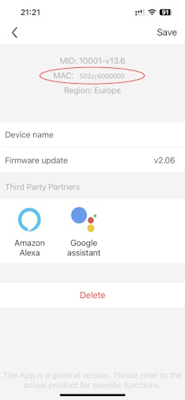

# Homebridge GREE Air Conditioner Platform Plugin

[Homebridge GREE Air Conditioner Platform Plugin](https://github.com/eibenp/homebridge-gree-airconditioner) is a dynamic platform plugin for [Homebridge](https://github.com/homebridge/homebridge) which allows control of GREE Air Conditioner devices from [Apple's Home app](https://www.apple.com/home-app/). (Make GREE Air Conditioner HomeKit compatible.)

You can add all of your GREE Air Conditioner devices to the Home App by specifying the network broadcast address, and Homebridge will find all connected devices. Each device appears in the Home App as a Heater Cooler device. It is also possible to add a separate Termperature Sensor (if temperature sensor is supported by the physical device). This allows to define automations (e.g. turn on) based on current temperature in the room. Be careful, if the device does not support internal temperature sensor but is added as a separate accessory, Home App will display the target temperature not the measured one. Child accessory does not appear in Home App if physical sensor is not available in the AC unit.

Quiet / Auto / Powerful mode is supported by the fan speed control. Minimum value turns on Quiet mode. Next value is Auto mode. Maximum value is Powerful mode. All other values between them are exact fan speeds (Low, MediumLow**, Medium, MediumHigh**, High)

** these values are supported only on 5-speed units

It is recommended to add all devices to the Homebridge configuration, so that you can control all their parameters. If you don't want to control all of the devices in Home App, then you need to add to the configuration and disable the ones you don't need. Devices are identified by MAC Address (Serial Number). It can be queried using the official [GREE+ mobile app](https://apps.apple.com/us/app/gree/id1167857672). (The app is required to connect the devices to the local WiFi network for the first time.)

xFan function is also supported, but it works automatically if enabled in Homebridge configuration. If xFan is enabled for the device, it is automatically turned on when you select a supported operating mode in Home App. If xFan is disabled, the Home App will not modify its actual setting in any case.

Temperature display units in the Home App are in sync with the AC unit's display. (Configuration settings are required to be specified always in Degrees Celsius, independently from the display units.)

Vertical swing mode can be turned on/off, but special swing settings can't be controlled using the Home App.

This plugin is designed to be as simple and clear as possible and supports primarily the functions of the Home App's Heater Cooler accessory.

## Requirements

* Node.js (>= 18.15.0) with NPM
* Homebridge (>= 1.6.0)

You need to specify the local network broadcast address (192.168.1.255 in many home environments) and it's also recommended to add the device and specify its MAC address (Serial Number) in the configuration file.

It is highly recommended to use static IP addresses for connected devices. Using a dynamic IP address may require a restart of the Homebridge service on an address change to reconnect the device. Most routers offer static DHCP leases. (Please look at your router's documentation!)

## Supported devices

* GREE Air Conditioners with WiFi support
* May work with other GREE compatible AC units

## Known limitations

This plugin was designed to support the Home App's Heater Cooler functionality using GREE Air Conditioners. Some special features of GREE AC's are not supported natively by Apple and also dismiss support in this plugin.
* Fan and dry modes are not supported. They may work if set directly on the device until you change operating mode. They can't be turned on using Home App.
* Lights of the AC unit can't be controlled.
* Additional device functions (e.g. health mode, sleep, SE) are not supported.
* Horizontal swing control is not supported, it remains the same as set directly on the device.

## Installation instructions

It is recommended to install the plugin using the graphical user interface of Homebridge ([Homebridge Config UI X](https://www.npmjs.com/package/homebridge-config-ui-x)). You can find the plugin if you search on the Plugins page for GREE Air Conditioner ('GREE AC' or '@eibenp/homebridge-gree-airconditioner' if you'd like an exact match). It is recommended to configure the plugin using the same GUI controls.

Command line install:
```
npm install @eibenp/homebridge-gree-airconditioner -g
```
If successfully installed and configured, your devices will appear on the Homebridge GUI Accessories page and also in Home App (if Homebridge is already connected to the Home App). (If the additional temperature sensor is enabled, then 2 items will be displayed for supported devices (Heater Cooler and Temperature Sensor).)

## Example configuration
_Only the relevant part of the configuration file is displayed:_
```
    "platforms": [
        {
            "name": "Gree Air Conditioner",
            "platform": "GREEAirConditioner",
            "port": 7002,
            "scanAddress": "192.168.1.255",
            "scanCount": 10,
            "scanTimeout": 5,
            "devices": [
                {
                    "mac": "502cc6000000",
                    "name": "Living room AC",
                    "model": "Pulse 3.2kW GWH12AGB-K6DNA1A/I",
                    "speedSteps": 5,
                    "statusUpdateInterval": 10,
                    "sensorOffset": 40,
                    "minimumTargetTemperature": 16,
                    "maximumTargetTemperature": 30,
                    "xFanEnabled": true,
                    "temperatureSensor": "disabled",
                    "disabled": false
                }
            ]
        }
    ]
```
* name - Unique name of the platform plugin
* platform - **GREEAirConditioner** (fixed name, it identifies the plugin)
* port - free UDP port (homebridge will use this port for network communication; it is recommended to select a port which is not used and the next 256 ports are also available because devices will be bound to a separate port based on the last part of the device's IPv4 address and the port specified in the configuration)
* scanAddress - local network broadcast address (some network knowledge is required to determine this address; in many cases its default value is 192.168.1.255)
* scanCount - number of retries for locating devices on the network (minimum 3 retries have to be specified)
* scanTimeout - time period in seconds between device query retries
* devices - devices should be listed in this block (specify as many devices as you have on your network)
* mac - MAC address (Serial Number) of the device
* name - custom name of the device (optional)
* model - model name, information only (optional)
* speedSteps - fan speed steps of the unit (valid values are: 3 and 5)
* statusUpdateInterval - device status will be refreshed based on this interval (in seconds)
* sensorOffset - device temperature sensor offset value for current temperature calibration (default is 40 °C, must be specified in Degrees Celsius)
* minimumTargetTemperature - minimum target temperature accepted by the device (default is 16 °C, must be specified in Degrees Celsius)
* maximumTargetTemperature - maximum target temperature accepted by the device (default is 30 °C, must be specified in Degrees Celsius)
* xFanEnabled - automatically turn on xFan functionality in supported device modes (xFan actual setting is not modified by the Home App if disabled)
* temperatureSensor - control additional temperature sensor accessory in Home App (disabled = do not add to Home App / child = add as a child accessory / separate = add as a separate (independent) accessory)
* disabled - set to true if you do not want to control this device in the Home App (old devices can be removed using this parameter)


## Tips

### MAC Address in GREE+ mobile app

Open selected device and in the upper right corner select menu symbol:



### Network broadcast address

All devices on the local network use the same broadcast address. The broadcast address can be calculated from the IP address and the subnet mask of any device which is connected to the LAN. (E.g. your router or computer) You can find several online calculators which help to determine the broadcast address.

On Unix-like systems you can query the broadcast address using the following command:
```bash
ifconfig | grep broadcast
# result
# inet 192.168.1.10 netmask 0xffffff00 broadcast 192.168.1.255
```
On Windows there is no easy way to read the broadcast address. You can query the IP address and the subnet mask using the following command:
```cmd
ipconfig
# result
# IPv4 Address. . . . . . . . . . . : 192.168.1.10
# Subnet Mask . . . . . . . . . . . : 255.255.255.0
# Default Gateway . . . . . . . . . : 192.168.1.254
```
## Refs & Credits

Special thanks to [tomikaa87](https://github.com/tomikaa87) and [kongkx](https://github.com/kongkx) for GREE network protocol information and code samples.

- [homebridge-gree-air-conditioner](https://github.com/kongkx/homebridge-gree-air-conditioner)
- [gree-remote](https://github.com/tomikaa87/gree-remote)
- [homebridge-gree-heatercooler](https://github.com/ddenisyuk/homebridge-gree-heatercooler)
- [Homebridge API](https://developers.homebridge.io/)
- [Homebridge Platform Plugin Template](https://github.com/homebridge/homebridge-plugin-template)