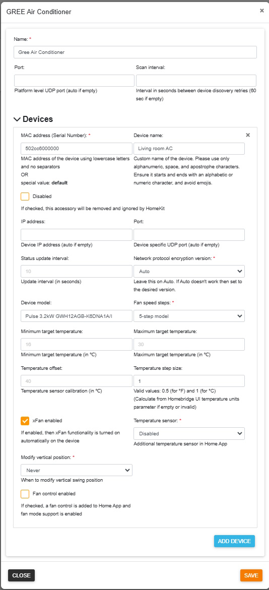
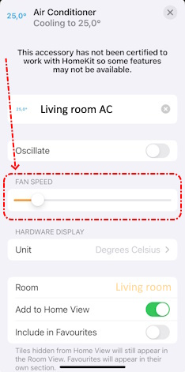

[](https://github.com/homebridge/homebridge/wiki/Verified-Plugins)
[](https://www.npmjs.com/package/homebridge-gree-ac)
[](https://www.npmjs.com/package/homebridge-gree-ac)
[](https://paypal.me/eibenp)

> _*** Breaking changes ***_
> 
> Please read the [**Upgrade section**](#upgrade) before upgrading from version earlier than **v2.0.0** !
>
> _It is also recommended to read the upgrade section before any upgrade. It contains useful information regarding the latest version._

# Homebridge GREE Air Conditioner Platform Plugin

[Homebridge GREE Air Conditioner Platform Plugin](https://github.com/eibenp/homebridge-gree-airconditioner) is a dynamic platform plugin for [Homebridge](https://github.com/homebridge/homebridge) which allows control of GREE Air Conditioner devices from [Apple's Home App](https://www.apple.com/home-app/). (Makes GREE Air Conditioner HomeKit compatible.)

You can add all of your GREE Air Conditioner devices to the Home App by specifying the device's MAC address, and Homebridge will find all connected devices. Each device appears in the Home App as a Heater Cooler device. It is also possible to add a separate Termperature Sensor (if temperature sensor is supported by the physical device). This allows to define automations (e.g. turn on) based on current temperature in the room. Be careful, if the device does not support internal temperature sensor but is added as a separate accessory, Home App will display the target temperature not the measured one. Child accessory does not appear in Home App if physical sensor is not available in the AC unit.

Quiet / Auto / Powerful mode is supported by the fan speed control. Zero means off. Minimum value turns on Quiet mode. Next value is Auto mode. Maximum value is Powerful mode. All other values between them are exact fan speeds (Low, MediumLow**, Medium, MediumHigh**, High)

** these values are supported only on 5-speed models

You have to add all devices to the Homebridge configuration. Devices are identified by MAC Address (Serial Number). It can be queried using the official [GREE+ mobile app](https://apps.apple.com/us/app/gree/id1167857672). (The app is required to connect the devices to the local WiFi network for the first time.) If an AC unit's MAC address is not added to the configuration then it will be skipped by the plugin. You can also skip a device by adding it to the configuration and setting the "disabled" parameter to true. _(This is useful if you want to temporarily remove the device but you want to keep it's parameters, e.g. changing the name is not possible without removal.)_

xFan function is also supported, but it works automatically if enabled in Homebridge configuration. If xFan is enabled for the device, it is automatically turned on when you select a supported operating mode in Home App. If xFan is disabled, the Home App will not modify its actual setting in any case.

Temperature display units of the physical device can be controlled using the Home App. (Configuration settings are required to be specified always in Degrees Celsius, independently from the display units.)

Vertical swing mode can be turned on/off, but special swing settings can't be controlled using the Home App. If device default vertical swing position is not acceptable in disabled swing mode, it can be overridden to a pre selected position by configuration settings. (Only default position is overridden when this feature is enabled. Other positions selected by remote control are kept and not modified by Home App. The AC unit may keep the actual vertical swing position on turning off oscillation in Home App.)

This plugin is designed to be as simple and clear as possible and supports primarily the functions of the Home App's Heater Cooler accessory.

## Requirements

* Node.js (>= 18.15.0 || >= 20.7.0 || >= 22.0.0) with NPM
* Homebridge (>= 1.8.0 || >= 2.0.0-beta.0)

The plugin finds all supported units automatically if they are located on the same subnet but controls only those which MAC address is added to the configuration. AC units on different subnets are also supported if the unit's IP address is set in the configuration. (MAC address have to be set correctly in this case also.)

IPv4 address is required. GREE Air Conditioners do not support IPv6 nor other network protocols.

This is not plugin dependency but its good to know that Homebridge server host address must be static. If the host address changes Homebridge looses connection with Home App and only Homebridge restart restores the connection.

## Supported devices

* GREE Air Conditioners with WiFi support (hardware version v1.x.x and v2.x.x)
* May work with other GREE compatible AC units (e.g. Sinclair)
    * Successfully tested with Sinclair SIH-13BITW
 
> If you get _"error:1C80006B:Provider routines::wrong final block length"_ error message then your device is not supported.
>
> If you don't get _"Device is bound ..."_ message within a few minutes after Homebridge startup and the correct MAC address is added to the configuration and the AC unit is accessible on the network then your device is not supported.

By default this plugin tries to auto detect the network protocol encryption version. If not the right version is selected there can get errors and the AC device will not correctly work. It is possible to force a network protocol encryption version in configuration file. If auto detection does not work then it is recommended to try all possible values to check if the device is compatible or not.

## Known limitations

This plugin was designed to support the Home App's Heater Cooler functionality using GREE Air Conditioners. Some special features of GREE AC's are not supported natively by Apple and also dismiss support in this plugin.
* Fan and dry modes are not supported. They may work if set directly on the device until you change operating mode. They can't be turned on using Home App.
* Lights of the AC unit can't be controlled.
* Additional device functions (e.g. health mode, sleep, SE) are not supported.
* Horizontal swing control is not supported, it remains the same as set directly on the device.
* GREE AC units do not support temperature ranges in auto mode, so temperature ranges have zero length in Home App.
* GREE AC units are not able to display decimals of temperature values (if set to half a degree, e.g. 21.5 °C, then unit display may not be in sync with temperature set in Home App).
* Not all half a degree values are supported in °C mode (GREE AC units are designed to support only integer °C and °F values). Unsupported values are automatically updated to the nearest supported values.
* There is no way to get current heating-cooling state from the AC unit in auto mode, so displayed state in the Home App is based on temperature measurement, but internal sensor is not precise enough to always display the correct state.
* Cooling / Heating temperature threshold limits (minimum and maximum values) can only be set in active cooling / heating mode. So the gauge in Home App may show invalid minimum and maximum values for the first use of cooling and heating modes. If so please restart Home App. Next time the correct values will be displayed.
* Devices without a built-in temperature sensor display the target temperature as current temperature not the measured one. (Some AC firmware versions do not report the measured temperature but the unit has a built-in sensor. They are handled by the plugin as devices without a sensor.)

## Installation instructions

It is recommended to install the plugin using the graphical user interface of Homebridge ([Homebridge Config UI X](https://www.npmjs.com/package/homebridge-config-ui-x)). You can find the plugin if you search on the Plugins page for GREE Air Conditioner ('GREE AC' or 'homebridge-gree-ac' if you'd like an exact match). It is recommended to configure the plugin using the same GUI controls.

Command line install:
```
npm install homebridge-gree-ac -g
```
If successfully installed and configured, your devices will appear on the Homebridge GUI Accessories page and also in Home App (if Homebridge is already connected to the Home App). (If the additional temperature sensor is enabled, then 2 items will be displayed for supported devices (Heater Cooler and Temperature Sensor).)

## Upgrade

### v2.0.0 - v2.1.1 to v2.1.2 or later

The upgrade is automatic by installing the latest version but configuration settings should be updated.

#### Configuration update steps

- <ins>Recommended:</ins> Using the graphical user interface of Homebridge ([Homebridge Config UI X](https://www.npmjs.com/package/homebridge-config-ui-x))
  1) Open plugin configuration
  1) Review and update settings if needed
  1) Save changes _(pressing the Save button is required to update the configuration to new version even if no changes needed in the displayed values)_
  1) Restart Homebridge
- **OR** <ins>Alternative:</ins> Edit the configuration file directly
  1) Remove the following parameters from the platform section:
     - port _(it may be kept if you want to set the UDP port manually)_
     - scanAddress
     - scanCount
     - scanTimeout
  1) Optionally you can add the following parameter to the platform section:
     - scanInterval _(default is 60 if missing, needed only if other value required)_
  1) Save changes
  1) Restart Homebridge

### v1.x.x to v2.0.0 or later

There is no clean way to update the plugin to release v2.0.0 or later if you are using an older version (v1.x.x). You need to remove and reinstall the plugin during upgrade.

#### Upgrade steps

1. Check out your current settings in Homebridge and also in Home App (including scenes and automation rules)
2. Uninstall the old version (this will remove all settings also)
3. Install the new version
4. Configure plugin in Homebridge
5. Assign accessories to rooms and recreate scenes and automations in Home App

## Example configuration
_Only the relevant part of the configuration file is displayed:_
```
    "platforms": [
        {
            "name": "Gree Air Conditioner",
            "platform": "GREEAirConditioner",
            "port": 7002,
            "scanInterval": 60,
            "devices": [
                {
                    "mac": "502cc6000000",
                    "name": "Living room AC",
                    "ip": "192.168.1.2",
                    "port": 7003
                    "statusUpdateInterval": 10,
                    "encryptionVersion": 0,
                    "model": "Pulse 3.2kW GWH12AGB-K6DNA1A/I",
                    "speedSteps": 5,
                    "minimumTargetTemperature": 16,
                    "maximumTargetTemperature": 30,
                    "sensorOffset": 40,
                    "temperatureSensor": "disabled",
                    "xFanEnabled": true,
                    "overrideDefaultVerticalSwing": 0,
                    "defaultVerticalSwing": 0,
                    "disabled": false
                }
            ]
        }
    ]
```
_It's not recommended to add the port and ip parameters. The above example contains them but only for showing all optional parameters also._

* name - Unique name of the platform plugin
* platform - **GREEAirConditioner** (fixed name, it identifies the plugin)
* port - free UDP port (optional) (plugin will use this port for network communication; valid values: 1025 - 65535) **Do not specify a port unless you have trouble with automatic port assignment!**
* scanInterval - time period in seconds between device query retries (defaults to 60 sec if missing)
* devices - devices should be listed in this block (specify as many devices as you have on your network)
  * mac - MAC address (Serial Number) of the device
  * name - custom name of the device (optional) Please use only alphanumeric, space, and apostrophe characters. Ensure it starts and ends with an alphabetic or numeric character, and avoid emojis.
  * ip - device IP address (optional) Address is auto detected if this parameter is missing. **Specify only if device is located on a different subnet then homebridge!**
  * port - free UDP port (optional) (plugin will listen on this port for data received from the device; valid values: 1025 - 65535) **Do not specify a port unless you have trouble with automatic port assignment!**
  * statusUpdateInterval - device status will be refreshed based on this interval (in seconds)
  * encryptionVersion - Auto (0) is fine for most AC units. If auto does not work then you can force v1 (1) or v2 (2) encryption version to use in network communication
  * model - model name, information only (optional)
  * speedSteps - fan speed steps of the unit (valid values are: 3 and 5)
  * minimumTargetTemperature - minimum target temperature accepted by the device (default is 16 °C, must be specified in °C, valid values: 16-30)
  * maximumTargetTemperature - maximum target temperature accepted by the device (default is 30 °C, must be specified in °C, valid values: 16-30)
  * sensorOffset - device temperature sensor offset value for current temperature calibration (default is 40 °C, must be specified in °C)
  * temperatureSensor - control additional temperature sensor accessory in Home App (disabled = do not add to Home App / child = add as a child accessory / separate = add as a separate (independent) accessory)
  * xFanEnabled - automatically turn on xFan functionality in supported device modes (xFan actual setting is not modified by the Home App if disabled)
  * overrideDefaultVerticalSwing - by default this plugin does not change the vertical swing position of the AC unit but some devices do not keep the original vertical position set by the remote control if controlled from Homebridge and return back to device default position; this setting allows to override the default position -> if AC unit is set to default vertical swing position Homebridge modifies it to a predefined position (set by defaultVerticalSwing) (Never (0) = turn off override, let device use default / After power on (1) = override default position on each power on / After power on and swing disable (2) = override default position on each power on and each time when swing is switched to disabled)
  * defaultVerticalSwing - specify the vertical swing position to be used instead of device default when overriding is enabled (Device default (0) = use device default, same position as used by device by default without overriding / one of the following 5 positions: fixed Highest (2), fixed Higher (3), fixed Middle (4), fixed Lower (5), fixed Lowest (6))
  * disabled - set to true if you do not want to control this device in the Home App _(can be used also to temporarily remove the device from Home App but not if the device is not responding any more on the network)_

Recommended configuration:



## Tips

### MAC Address in GREE+ mobile app

Open selected device and in the upper right corner select menu symbol:


### MAC address alternative detection method

If you are not familiar with the GREE+ mobile app there is an alternative method to detect the MAC address of your devices:

- Install the plugin
- Do not configure AC unit devices
- (Re)start Homebridge
- GREE Air Conditioner Platform Plugin will auto detect all accessible devices and write an entry to the log
- The log entry contains the MAC address of the device E.g.: MAC address is 502cc6000000 in the following log entry:

> Accessory **502cc6000000** not configured - skipped

Unfortunaltely if you have multiple devices you will not know which MAC address belongs to which AC unit. In this case you have to test it. This may require some adding - removal - re-adding cycle before final configuration.

### Device settings

Some settings are initialized by Home App only once (when enabling the device). They can only be changed by disabling and re-enabling the device. The following settings are affected:

* name
* model
* speedSteps

All other settings are applied when starting up Homebridge. You have to restart Homebridge to apply changes in configuration settings.

### IP address

IP addresses of the AC units are determined automatically by the plugin. However this auto detection works only if the AC unit is on the same subnet as homebridge. There is an optional IP address parameter which can be used to specifiy the unit's IP address if it is on a different subnet. (Routing should be correctly set up to communicate with units on different subnets.)

### Port

Network communication uses UDP ports. There are two kind of ports:

- Plugin port. This port is used by the plugin to communicate on the network.
- Device specific port. The plugin is listening for data received from the device using this port.

All ports are set up automatically by default. In some cases auto detection is not appropriate. (E.g. when firewall rules should be set up) It is possible to overwrite the default ports by optional port parameters (for the plugin and also for each devices).

### Temperature display units

Home App allows to set the device temperature display units but it is independent from the temperature units shown in Home App. Home App always displays temperature values as specified by iOS/MacOS (can be changed in Preferences / Regional settings section). Display unit conversion is made by the Home App device (e.g. iPhone).

### Temperature measurement

Temperature measurement is not perfect if using the built-in sensor. It is highly affected by current operation and can differ from actual temperature of other places in the room. It is recommended to use a sperarate HomeKit compatible temperature sensor and place it not too close to the AC unit if you plan to set up automations based on temperature values.

### Invalid room temperature

Some AC units have a built-in temperature sensor but the actual room temperature is not displayed in Home App. This is an AC firmware problem. Older firmware versions do not report temperature values at all and there are some firmware versions which report a fixed value (e.g. zero) instead of the measured one. This plugin replaces the missing value and the fixed zero value by the desired target temperature. To get the correct measured temperature please try to upgrade or downgrade the AC firmware.

### Fan speed

Fan speed is adjustable on the Heater Cooler's settings page in Home App. There is a gear icon in the buttom right corner of the Heater Cooler page if it was opened from the Home App (gear icon is missing if opened from control center or home view of control center). This gear icon can be used to access settings (and fan speed).



Slider description: Zero means off. Minimum value turns on Quiet mode. Next value is Auto mode. Maximum value is Powerful mode. All other values between them are exact fan speeds (Low, MediumLow**, Medium, MediumHigh**, High)

** these values are supported only on 5-speed models

### Accessory removal

If an AC unit is still working and accessible on the network you can remove the associated accessory by setting the device's "disabled" parameter to true and restarting Homebridge.

If you need to remove an old AC unit which is not accessible any more (e.g hardware failure or device was replaced with a new one) you need to use the graphical user interface of Homebridge ([Homebridge Config UI X](https://www.npmjs.com/package/homebridge-config-ui-x)). Follow these steps:
1) Open Homebridge GUI
1) Go to Settings page
1) Go to Accessories section
1) Select Remove Single Accessory
1) Search for the accessory to be removed in list
1) Click on the waste icon of the selected accessory

On some platforms the graphical user interface of Homebridge does not support accessory removal. In this case you have to remove and reinstall the plugin to remove a deprecated accessory or you need to manually edit the cache file (it requires advanced Homebridge technical knowledge).

### Troubleshouting

Most known errors are fixed by later versions. If so yo can upgrade to the latest version and it will solve the problem. Some errors may require some additional steps.

#### "Failed to save cached accessories to disk: Converting circular structure to JSON" error

This error is fixed in v2.1.2 and later. First upgrade the plugin to the latest version and restart Homebridge twice. Wait a few minutes between restarts. If it does not solve the problem follow these steps:

1) Uninstall the plugin (and remove the child bridge if a dedicated child bridge was added)
1) Go through all cached accessories and delete every instance of accessories created by this plugin:
   - Homebridge GUI > Settings page
   - Accessories section > Remove Single Accessory
   - Click the waste icon of the selected accessory
1) Restart Homebridge
1) Install the latest version of the plugin
1) Configure the plugin

Do not try to restore Homebridge configuration from backup because this error means that the cached configuration is corrupt and all the backups contain also the corrupt configuration! Restoring settings from backup will restore the error also.

#### Unusual behaviour

Check if you are using the correct version of configuration settings. It is always recommended to open and save the actual configuration settings using the graphical user interface of Homebridge. Pressing the Save button on the GUI automatically converts the configuration settings to the actual version. It is useful to re-save the configuration after each upgrade or downgrade even if there are no visible changes in the parameters.

#### Device not responding

If an AC unit device is not supported it may be added successfully to the Home App as an accessory but never appears the "Device is bound ..." message in the Homebridge log. Unbound devices can't respond to network requests so they are unresponsive in Home App. There is no way to decide if the unresponsive device is only turned off (no AC power) or it has a not supported firmware version. It means that a missing error message does not mean that the device is supported. You can check the Homebrdige log. All supported devices write a "Device is bound ..." message into the Homebridge log after successful configuration upon Homebridge startup.

## Refs & Credits

Special thanks to [tomikaa87](https://github.com/tomikaa87) and [kongkx](https://github.com/kongkx) for GREE network protocol information and code samples. Thank you [mateuszm7](https://github.com/mateuszm7) and [zivanek](https://github.com/zivanek) for helping to implement the version 2 network protocol.

- [homebridge-gree-air-conditioner](https://github.com/kongkx/homebridge-gree-air-conditioner)
- [gree-remote](https://github.com/tomikaa87/gree-remote)
- [homebridge-gree-heatercooler](https://github.com/ddenisyuk/homebridge-gree-heatercooler)
- [Homebridge API](https://developers.homebridge.io/)
- [Homebridge Platform Plugin Template](https://github.com/homebridge/homebridge-plugin-template)
- [HomeAssistant-GreeClimateComponent](https://github.com/RobHofmann/HomeAssistant-GreeClimateComponent)